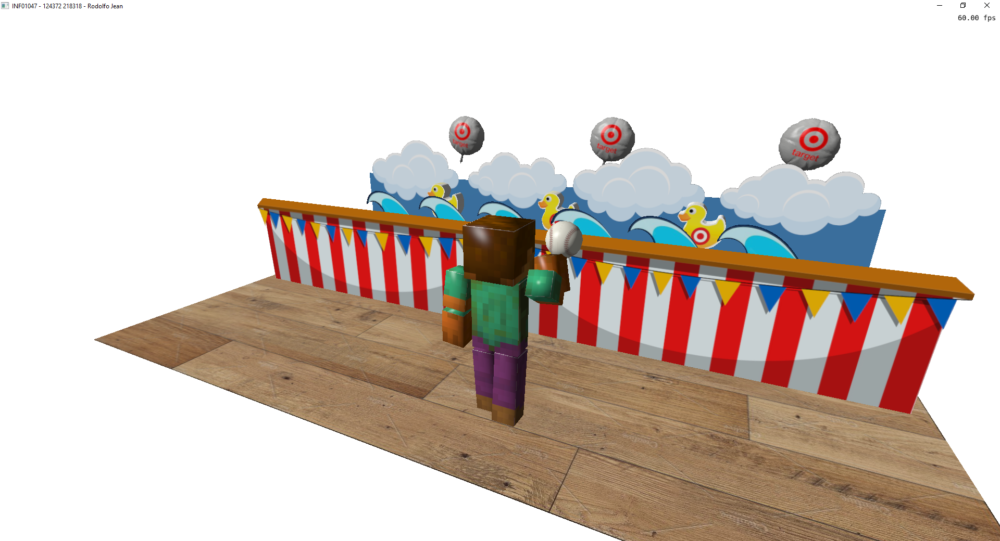
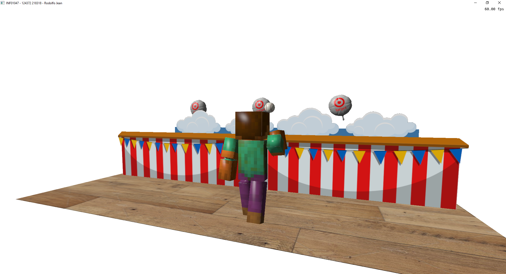
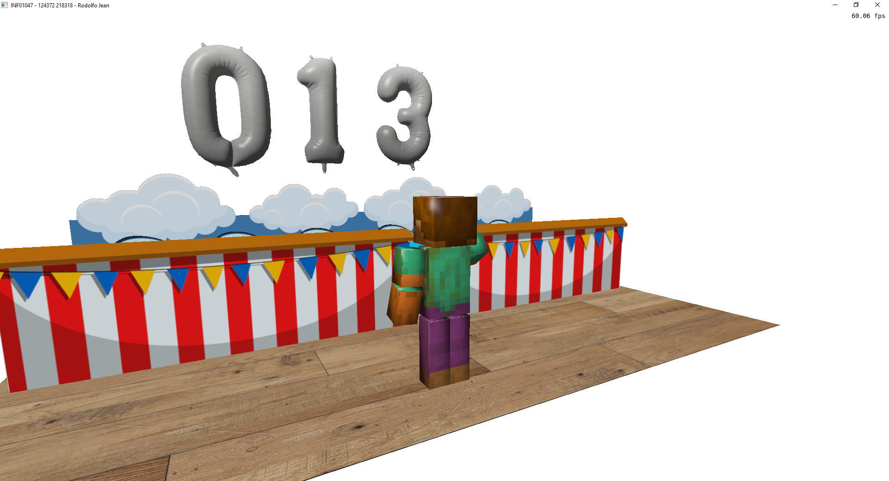

# Trabalho Final de Fundamentos de Computação Gráfica

Foi implementado um jogo onde o objetivo é arremessar uma bolinha, acertando os alvos no menor tempo possível. São 6 alvos (3 patos e 3 balões).

O tempo utilizado é mostrado ao acertar todos os alvos.

# Contribuições para o trabalho:
## Rodolfo Barbosa
- Código para desenhar os modelos
- Animações
- Texturas
- Iluminação

## Jean Ribeiro
- Documentação
- Organização do repositório Git
- Correção de bugs
- Otimização do código
- Correções na câmera livre

# Ferramentas externas
Não foram utilizados o ChatGPT ou outras ferramentas para realização deste trabalho.

# Controles
- W, A, S, D - Movimentação do personagem
- Clicar com o esquerdo - Arremessar a bolinha
- N - Novo Jogo
- C - Alternar entre câmera livre e normal (Look-at)

# Compilação e Execução da aplicação
O projeto foi criado com o CodeBlocks utilizando os projetos dos Laboratórios de aula como base, não sendo necessárias configurações ou bibliotecas adicionais. A compilação é executada diretamente pelo Codeblocks, de preferência no modo Release.

# Jogo em execução

